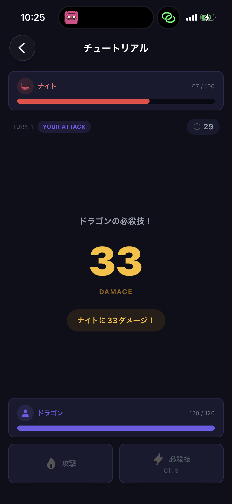

# NTAG Card Battle

物理NTAGカードをスマホで読み取り、カードに紐づいたキャラクターでリアルタイム対戦するカードバトルゲーム。

<p align="center">
  
</p>

## 概要

- NTAGカードのUIDをiPhoneのNFCで読み取り、サーバに登録
- 管理画面でカードにキャラクターを割り当て
- QRコードでルームを共有して2人対戦（未実装）、またはチュートリアルでCPU対戦

## 技術スタック

| レイヤー         | 技術                                                        |
| ---------------- | ----------------------------------------------------------- |
| モバイルアプリ   | Expo (React Native) + NativeWind + react-native-nfc-manager |
| バックエンド     | Next.js カスタムサーバ (TypeScript)                         |
| リアルタイム通信 | Socket.io                                                   |
| データベース     | PostgreSQL + Prisma ORM                                     |
| インフラ         | Docker Compose                                              |

## プロジェクト構成

```
nfc-card-battle/
├── apps/
│   ├── server/          # Next.js + Socket.io + Prisma
│   │   ├── src/
│   │   │   ├── app/     # Next.js App Router (API + 管理画面)
│   │   │   ├── game/    # バトルエンジン・ルーム管理・Socket.ioイベント
│   │   │   └── lib/     # Prisma クライアント
│   │   └── prisma/      # スキーマ・マイグレーション・シード
│   └── mobile/          # Expo アプリ
│       ├── app/         # expo-router 画面
│       │   ├── (tabs)/  # ホーム・マイカード
│       │   └── battle/  # バトル画面・チュートリアル
│       └── lib/         # Socket.io クライアント・NFC ユーティリティ
└── packages/
    └── shared/          # 共有型定義・定数
```

## セットアップ

### 必要なもの

- Node.js 18+
- pnpm 9+
- Docker (PostgreSQL 用)
- Xcode (iOS実機ビルド用)
- NTAGカード (NFC対応のもの)

### 1. 依存関係のインストール

```bash
pnpm install
```

### 2. データベースの起動と初期化

```bash
# PostgreSQL コンテナ起動
pnpm docker:up

# スキーマ反映
pnpm db:push

# 初期キャラクターデータ投入
pnpm db:seed
```

### 3. 環境変数の設定

```bash
# サーバ
cp apps/server/.env.example apps/server/.env

# モバイル
cp apps/mobile/.env.example apps/mobile/.env
```

モバイルアプリからサーバに接続するため、`apps/mobile/.env` の `EXPO_PUBLIC_SERVER_URL` をサーバのアドレスに設定してください。ローカル開発ではngrokなどのトンネルが便利です。

### 4. サーバ起動

```bash
pnpm dev:server
# http://localhost:3000 で起動
# 管理画面: http://localhost:3000/admin/cards
```

### 5. モバイルアプリ起動

```bash
pnpm dev:mobile
```

iOS実機で動かす場合:

```bash
cd apps/mobile
npx expo prebuild --platform ios
# Xcode で apps/mobile/ios/*.xcworkspace を開いてビルド
```

## 遊び方

### カードの準備

1. モバイルアプリの「マイカード」タブでNTAGカードをスキャンして登録
2. 管理画面 (`/admin/cards`) でカードにキャラクターを割り当て

### チュートリアル (CPU対戦)

1. ホーム画面の「チュートリアル」をタップ
2. NFCカードをスキャンしてキャラクターをセット
3. CPUにはランダムでキャラクターが割り当てられる
4. ターン制バトル開始

### 対人対戦（未実装）

1. ホスト: 「ルーム作成」をタップしてQRコードを表示
2. ゲスト: 「QRスキャンで参加」でQRコードを読み取る
3. 両者がNFCカードを登録するとバトル開始

## バトルシステム

ターン制で「攻撃ターン」と「防御ターン」が交互に切り替わります。

| ターン     | 選択肢     | 効果                                                  |
| ---------- | ---------- | ----------------------------------------------------- |
| 攻撃ターン | 攻撃       | ATK - 相手DEF のダメージ                              |
|            | 必殺技     | ATK x1.8 の大ダメージ (使用後3ターンクールダウン)     |
| 防御ターン | 防御       | ダメージ軽減 (DEF x2 で計算)                          |
|            | カウンター | 成功率30%で ATK x1.5 の反撃、失敗すると軽減なしで被弾 |

### キャラクター一覧

| 名前       | HP  | ATK | DEF | 特徴       |
| ---------- | --- | --- | --- | ---------- |
| ドラゴン   | 120 | 35  | 15  | バランス型 |
| ナイト     | 100 | 25  | 30  | 防御型     |
| ウィザード | 80  | 45  | 10  | 攻撃特化   |
| ゴーレム   | 150 | 20  | 35  | 耐久型     |
| アサシン   | 70  | 50  | 5   | 超攻撃型   |
| プリースト | 90  | 15  | 25  | 堅実型     |

## API

| エンドポイント        | メソッド | 説明                                         |
| --------------------- | -------- | -------------------------------------------- |
| `/api/cards`          | GET      | 登録済みカード一覧                           |
| `/api/cards`          | POST     | カード登録 (`{ id: "UID" }`)                 |
| `/api/cards`          | PATCH    | キャラクター割当 (`{ cardId, characterId }`) |
| `/api/characters`     | GET      | キャラクター一覧                             |
| `/api/characters`     | POST     | キャラクター作成                             |
| `/api/characters/:id` | PATCH    | キャラクター更新                             |
| `/api/characters/:id` | DELETE   | キャラクター削除                             |

## 開発コマンド一覧

```bash
pnpm install            # 依存関係インストール
pnpm dev:server         # サーバ起動
pnpm dev:mobile         # Expo アプリ起動
pnpm docker:up          # PostgreSQL 起動
pnpm docker:down        # PostgreSQL 停止
pnpm db:push            # スキーマを DB に反映
pnpm db:seed            # シードデータ投入
pnpm db:migrate         # マイグレーション実行
pnpm build:server       # サーバビルド
```

## ライセンス

MIT
